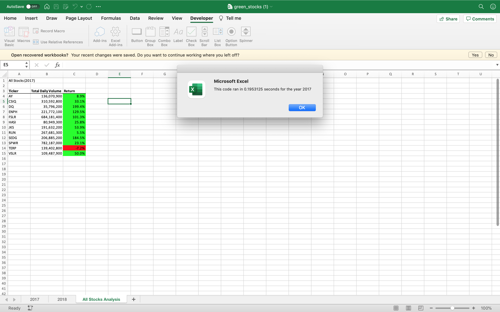
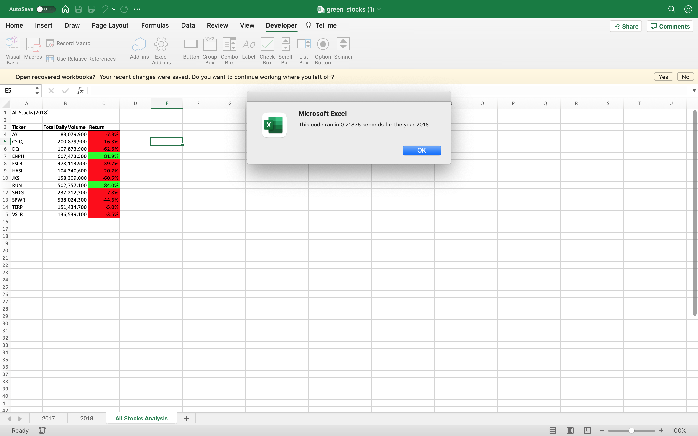

## Overview 
This analysis shows the total daily volume calculated for all the tickers and the return is calculated based on the starting price and the ending price for the year 2017 and year 2018. The code is refactored so that to expand the dataset to include the entire stock market over the last few years in less amount of time.
## Results of 2017 Analysis:
As a part of Refactoring tickerIndex is defined to access the ticker, tickeVolumes,tickerStartingPrices and tickerEndingPrices. 

**tickerVolumes(tickerIndex) = tickerVolumes(tickerIndex) + Worksheets(yearValue).Cells(i, 8).Value**

tickerVolumes(tickerIndex) stores the total volume of the selected ticker.

**If Worksheets(yearValue).Cells(i, 1).Value = currentTicker And Worksheets(yearValue).Cells(i - 1, 1).Value <> currentTicker Then
          tickerStartingPrices(tickerIndex) = Worksheets(yearValue).Cells(i, 6).Value
        End If**

Here tickerStartingPrices(tickerIndex) stores the starting prices of the selected ticker provided Cells(i, 1).Value is the first row of the selected ticker and Cells(i - 1, 1).Value is not the  currentTicker
 
 **If Worksheets(yearValue).Cells(i, 1).Value = currentTicker And Worksheets(yearValue).Cells(i + 1, 1).Value <> currentTicker Then
            tickerEndingPrices(tickerIndex) = Worksheets(yearValue).Cells(i, 6).Value
            tickerIndex = tickerIndex + 1
        End If**
         
Here tickerEndingPrices(tickerIndex) stores the ending prices of the selected ticker provided Cells(i, 1).Value is the last row of the selected ticker and Cells(i +1, 1).Value is not the  currentTicker. If the condition satisfies, tickerIndex is incremented to 1.

### Stock Performance of 2017:
The Returns of the all the tickers except TERP has a positive return. DQ has the highest positive return of 199.4% 

### Screenshot of 2017 Stock Performance:

### Stock Performance of 2018
Only the tickers ENPH and RUN has a positive return. All the other tickers has a negative return being JKS with the negative return of -60.5%

### Screenshot of 2018 Stock Performance

## Summary:

### Advantages and Disadvantages of refactoring code in general:
* We can see that refactoring allows to work on a wide amount of data with few lines of code.
* The processing speed is high.

### Advantages and Disadvantages of the original and refactored VBA script:
* The Refactored VBA script allows us to to expand the dataset to include the entire stock market over the last few years in less amount of time.
* Debugging is tricky as the loops are formed based on the tickerIndex.

